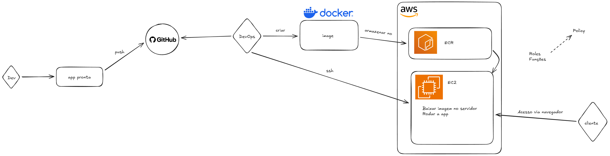

# 🚀 Lab DevOps: Containerização e Deploy Manual na AWS


## 📋 Índice

1. [Visão Geral](#-visão-geral)
2. [Arquitetura do Projeto](#-arquitetura-do-projeto)
3. [Fase 1: Containerização Local (Docker)](#-fase-1-containerização-local-docker)
4. [Fase 2: Registro Privado na Nuvem (AWS ECR)](#-fase-2-registro-privado-na-nuvem-aws-ecr)
5. [Fase 3: Provisionamento e Segurança (AWS EC2 & IAM)](#-fase-3-provisionamento-e-segurança-aws-ec2--iam)
6. [Fase 4: Deploy em Produção](#-fase-4-deploy-em-produção)
7. [Próximos Passos](#-próximos-passos)

---

## 🎯 Visão Geral

Este repositório documenta minha jornada prática de estudos em Engenharia DevOps. O objetivo deste laboratório foi simular um cenário real de infraestrutura, eliminando o problema de "funciona na minha máquina".

Peguei um website estático simples e realizei o deploy em uma instância EC2 na AWS, garantindo portabilidade através de containers Docker e aplicando princípios de segurança (Least Privilege) com IAM Roles.

---

## 🏗️ Arquitetura do Projeto



**Fluxo de Funcionamento:**

1. Código empacotado localmente gerando uma Imagem Docker (`nginx:alpine`).
2. Imagem enviada com segurança para um repositório privado na nuvem (AWS ECR).
3. Servidor Linux (EC2) provisionado na AWS.
4. EC2 assume uma permissão temporária (IAM Role) para baixar a imagem do ECR.
5. Container entra em execução expondo a porta 80 para a internet.

---

## 🐳 Fase 1: Containerização Local (Docker)

Foi criado um arquivo `Dockerfile` na raiz do projeto para empacotar a aplicação utilizando um servidor web Nginx leve.

```dockerfile
# Imagem base ultraleve
FROM nginx:alpine

# Copia os arquivos do site para a pasta padrão do Nginx
COPY website/ /usr/share/nginx/html/

# Expõe a porta de comunicação
EXPOSE 80

# Mantém o container rodando em primeiro plano
CMD ["nginx", "-g", "daemon off;"]

```

Comandos de Build e Teste Local:

```bash
# Construir a imagem
docker build -t meu-site:1.0 .

# Rodar para testar localmente na porta 8080
docker run -d -p 8080:80 --name site-teste meu-site:1.0
```

## ☁️ Fase 2: Registro Privado na Nuvem (AWS ECR)

Para não deixar a imagem pública, criei um repositório no Elastic Container Registry (ECR).

Autenticação e Upload (Push):

```bash

# Autenticar o Docker local na AWS
aws ecr get-login-password --region sa-east-1 | docker login --username AWS --password-stdin [SEU_ACCOUNT_ID].dkr.ecr.sa-east-1.amazonaws.com

# "Etiquetar" a imagem com o destino da nuvem
docker tag meu-site:1.0 [SEU_ACCOUNT_ID].dkr.ecr.sa-east-1.amazonaws.com/meu-site:1.0

# Enviar para a AWS
docker push [SEU_ACCOUNT_ID].dkr.ecr.sa-east-1.amazonaws.com/meu-site:1.0
```

## 🔒 Fase 3: Provisionamento e Segurança (AWS EC2 & IAM)

Para hospedar o site, criei uma máquina virtual Amazon Linux 2023 (t3.micro).

Configuração do Firewall (Security Group)

- Porta 22 (SSH): Liberada APENAS para o meu IP local.
- Porta 80 (HTTP): Liberada para a internet (0.0.0.0/0).

Segurança com IAM Roles

Ao invés de inserir senhas estáticas (aws configure) dentro do servidor, criei uma IAM Role com a política AmazonEC2ContainerRegistryReadOnly e anexei à EC2. Isso garante que a máquina tenha permissão de ler o ECR sem expor credenciais root.

## 🚀 Fase 4: Deploy em Produção

Acessando o servidor via SSH, preparei o ambiente e rodei a aplicação.

```bash
# Atualizar sistema e instalar Docker
sudo yum update -y
sudo yum install docker -y
sudo systemctl start docker
sudo usermod -a -G docker ec2-user

# Autenticar no ECR (funciona graças à IAM Role)
aws ecr get-login-password --region sa-east-1 | docker login --username AWS --password-stdin [SEU_ACCOUNT_ID].dkr.ecr.sa-east-1.amazonaws.com

# Baixar e executar a imagem
docker pull [SEU_ACCOUNT_ID].dkr.ecr.sa-east-1.amazonaws.com/meu-site:1.0
docker run -d -p 80:80 --name site-prod [SEU_ACCOUNT_ID].dkr.ecr.sa-east-1.amazonaws.com/meu-site:1.0
```

Resultado: Site acessível publicamente através do IP da EC2.

## 👣 Próximos Passos

O próximo objetivo deste laboratório é evoluir esta infraestrutura manual para Infraestrutura como Código (IaC) utilizando Terraform, automatizando a criação da VPC, ECR, EC2 e Security Groups.
